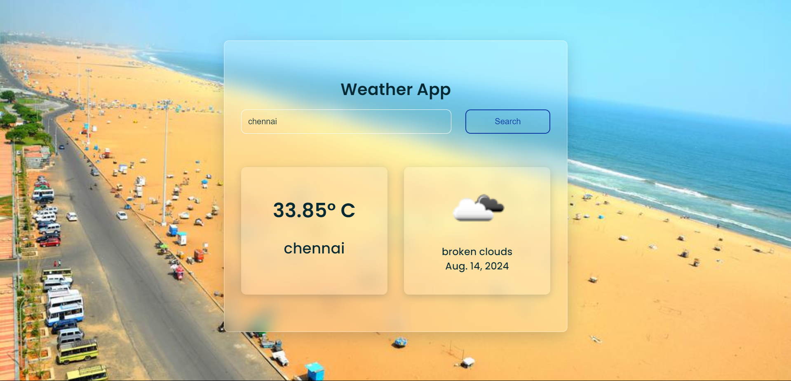

# Weather App

## Overview
The Weather App is a Django-based web application that provides current weather information for a given city. The app uses the OpenWeatherMap API for weather data and the Google Custom Search API for city images.

## Features
- Displays current weather information including temperature, weather description, and an icon.
- Allows users to search for weather information by city name.
- Defaults to showing weather information for Indore on the initial load.
- Provides error messages for empty or invalid city inputs.

## Technologies Used
- **Django**: Web framework for building the application.
- **Requests**: Library for making HTTP requests to external APIs.
- **OpenWeatherMap API**: Provides weather data.
- **Google Custom Search API**: Retrieves images related to the city.

## Installation

1. **Clone the Repository:**
   ```sh
   git clone https://github.com/varunchithiraala/Weather-App.git
2. **Navigate to the Project Directory:**
    ```sh
    cd weather_app
3. **Install Dependencies:**
    ```sh
    pip install -r requirements.txt
4. **Apply Migrations:**
    ```sh
    python manage.py migrate
5. **Run the Development Server:**
    ```sh
    python manage.py runserver
6. **Access the App:**
    Open your web browser and go to [http://127.0.0.1:8000/](http://127.0.0.1:8000/).

## Usage

- Enter a city name in the search field and click "Search" to view the current weather.
- If no city is entered or an invalid city is provided, an appropriate error message will be displayed.

## Project Screenshot



## Acknowledgements

We would like to acknowledge and thank the following for their contributions and support:

- **OpenWeatherMap API**: For providing weather data.
- **Google Custom Search Engine**: For supplying the image search functionality.
- **Pexels**: For the default background image used when no search results are available.
- **Django**: For the web framework that powers the app.
- **Bootstrap**: For the styling framework used to enhance the UI.

## Additional Information

- **Documentation**: For more information on Django and related technologies used in this project, visit the [Django Documentation](https://docs.djangoproject.com/en/stable/).
- **Support**: If you encounter any issues or need help, please open an issue on the project's [GitHub Issues page](https://github.com/varunchithiraala/Weather-App/issues).
- **License**: This project is licensed under the MIT License. See the [LICENSE](LICENSE) file for details.

## Contributing

We welcome contributions to enhance the Weather App. To contribute, please follow these steps:

1. **Fork the Repository**: Create a personal copy of the repository by forking it.
2. **Clone the Repository**: Clone your forked repository to your local machine using:
   ```bash
   git clone https://github.com/varunchithiraala/Weather-App.git
3. **Create a Branch**: Create a new branch for your feature or bug fix:
   ```bash
   git checkout -b feature/Weather-App
4. **Make Changes**: Implement your changes and commit them with clear, descriptive messages.
5. **Push Changes**: Create a new branch for your feature or bug fix:
   ```bash
   git push origin feature/Weather-App
6. **Create a Pull Request**: Open a pull request on the original repository, describing the changes you made.

Please ensure your code adheres to the project's coding standards and passes all tests before submitting a pull request.

## License

This project is licensed under the MIT License - see the [LICENSE](LICENSE) file for details.

## Contact

For any questions or feedback, please contact:

- **Name:** Ch. Varun Kumar
- **Email:** varuncvk13@gmail.com
- **GitHub:** [https://github.com/varunchithiraala](https://github.com/varunchithiraala)
